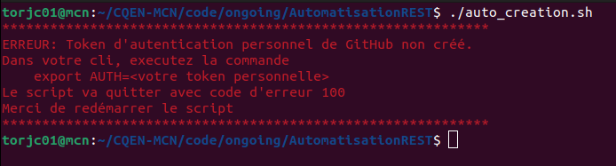

<!-- ENTETE -->
[](https://www.quebec.ca/gouv/politiques-orientations/vitrine-numeriqc/accompagnement-des-organismes-publics/demarche-conception-services-numeriques)
[](https://github.com/CQEN-QDCE/.github/blob/main/LICENCE.md)

---
<!-- FIN ENTETE -->

# Automatizaçao para a criaçao de projetos pessoais

L'automatisation de création de dépôts pour le Lab du CEAI.

## Prérequis

D'abord, il faut avoir un système d'exploitation de type Unix (Linux, MacOS, BSD, etc), pour pouvoir exéecuter les scripts bash. Si vous travaillez dans Windows, vous pouvez déployer un conteineur qui exécute un système d'exploitation compatible; ou vous pouvez vous installer l'outil GitBash dans l'environnement Windows.  

Il fault avoir quelques outils installés sur le poste avant de lancer le script: `curl` pour faire lancer les requêtes REST, `jq` pour faire le parsing des JSON et `sed` pour faire l'édition de texte en temps réel dans le script. 

En plus, si vous allez créer des nouveaux fichiers à inclure dans le dépôt, il vous faudra un outil qui fait la codification des fichiers en Base64. On vous recommende d'utiliser `openssl` qui est disponible d'amblé dans la plupart des systèmes basés sur Unix.  

Vérifiez s'ils sont installés, avec les commandes suivantes: 

```
$ curl --version
$ jq --version
$ sed --version
$ openssl version
```

Si vous ne trouvez pas un des outils ci-dessus, faites l'installation des outils manquants

```
$ sudo apt-get install curl jq sed openssl 
```

Le script doit être lancé par les utilisateurs administrateurs du compte du CQEN dans Github. Seulement ces utilisateurs administrateurs auront les droits néecessaires pour la génération et l'écriture des nouveaux dépôts de code dans la plateforme. 

Pour vous identifier comme usager authentifié, vous devez créer un token d'accès personnel. Pour le faire, allez sur le site de github sur l'adresse [https://github.com/settings/apps](https://github.com/settings/apps), choissez `Personal access tokens` et cliquez sur le bouton `Generate new token`. Ensuite, selectionnez tous les scopes qui vous seront présentés et cliquez sur le bouton vert `Generate token` au bas de la page. Prenez note du token qui sera montré, car il ne sera plus possible de faire une nouvelle visualisation. 

Dans votre ligne de commande, faites la création d'une variable d'environnement appelée `AUTH` avec le contenu du token généré

```
$ export AUTH=<contenu du token>
```

Si la variable d'environnement n'existe pas, vous aurez l'erreur suivante dans votre ligne de commande




## Exécution du script

Faites le téléchargement de ce dépôt dans votre machine locale 


```
$ git clone https://github.com/CQEN-QDCE/AutomatisationREST.git
$ cd AutomatisationREST
```

Ensuite, lancez le script avec la commande 

```
$ ./auto_creation.sh
```

Le script est iteractive, il vous posera quelques questions par rapport au dépôt que vous voulez créer. Veuillez répondre aux questions suivantes: 

- **Nom du dépot:** Le nom du dépôt qui sera créé dans Github. Assurez-vous qu'il n'existe pas de dépôts avec ce même nom dans le Github du CQEN. 
- **Description du dépôt:** Faites une description sommaire de ce dépôt et incluez l'OP resposable pour le projet.  
- **Nom de l'équipe de travail de l'OP:** Donnez un nom distinctif à l'équipe qui travaillera dans ce projet. Ce nom d'équipe servira a donner les droits d'accès et écriture au projet, créeez une denomination claire. 
Une suggestion de format serait la suivante: `OP_<abbregé du nom de l'OP>_<nom du projet>`. Par exemple, `OP_MCN_Blockchain`, pour une équipe de travail du CQEN qui travaillerait sur un projet nommé `Blockchain`.
- **Description de cette équipe de travail:** Faites une description sommaire de cette équipe de travail et du projet qu'ils auront travailler.
- **Nom d'usager github du mainteneur du dépôt de l'OP:** Indiquez le nom d'usager github de la personne qui sera le mainteneur du projet. Elle sera la personne de l'équipe qui gère les membres qui travaillent dans le projet et peut agir comme réviseur et approbateur des issues et des pull requests. 
- **Votre nom d'usager github:** Indiquez ici votre nom d'usager github. Le token que vous avez crée doit appartenir à ce même compte d'usager.
- **Votre email:** Le courriel lié à votre compte d'usager. Ces deux informations seront utilisés pour faire le sign-off des commits qui seront faits dans la création de fichiers default pour le dépôt. 

À la fin des questions, le script vous montrera toutes les informations recueillies et vous demandera de vérifier leur exactitude. 

Si tout est beau, le script partira la génération du nouveau dépôt avec les informations fournies par vous. 

Si vous détectez des erreurs, répondez non à la confirmation et le script s'arretera. 

## Insertion de fichiers

Si vous voulez insérer des fichiers via un appel de la REST API, il faut codifier le fichier en format base64.

Pour le faire, il faut avoir installé sur la machine locale l'outil `openssl`. Référez-vous à la section des prérequis pour les détails.

La conversion doit être faite sans l'inclusion de nouvelle ligne ou de `padding` au fichier de sortie. L'action par défault de openssl est de créér la sortie en lignes de 72 caractères, et faire un padding à la fin avec du space à blanc. Dans la commande de codification, on va rajouter la flag `-A` pour empêcher ce comportement du openssl. 

Par exemple, pour codifier le fichier `exemple.txt` qui est dans le répertoire actuel, utilisez la commande suivante: 

```bash
$ openssl base64 -e -in exemple.txt -A > exemple.b64 
```

Ensuite, déposez le fichier converti dans le répertoire `./doc` et l'utilisez dans le script `04-fichiers-creation.sh`